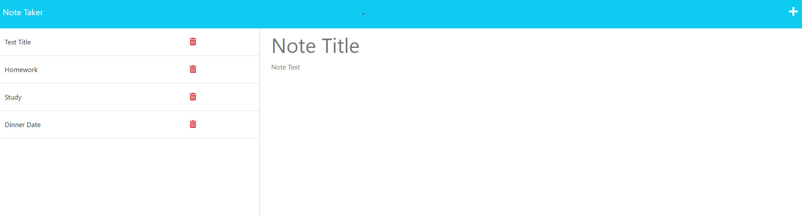

# Note Taker App

## Description
This project is an application called Note Taker that can be used to write and save notes. The application uses an Express.js back end and will save and retrieve note data from a JSON file. The application’s front end has already been created. I built the back end, connected the two, and then deployed the entire application to Heroku.
## Deployed Application Link

## Table of Contents
- [Note Taker App](#note-taker-app)
  - [Description](#description)
  - [Deployed Application Link](#deployed-application-link)
  - [Table of Contents](#table-of-contents)
  - [Languages \& Technologies Used](#languages--technologies-used)
  - [Useage](#useage)
  - [Questions](#questions)
  - [License](#license)

## Languages & Technologies Used
JavaScript, Node.js v16, Express.js,
## Useage
Visit the Heroku deployed page and click get started. Type in your title and text for note and click save icon in the top right corner. To delete a note click the red delete icon next to the saved note column.

Short Demo:
https://drive.google.com/file/d/1fjjm0pWGFOvcWoze7P5bKC2JeN5BPZbE/view

## Questions
Check out my work at [github/dsoda86](https://github.com/dsoda86).

Please send your questions to  [dsoda86@gmail.com](mailto:dsoda86@gmail.com?subject=[GitHub]%20Dev%20Connect).
## License

Click to learn more about this license and other commonly used licenses.